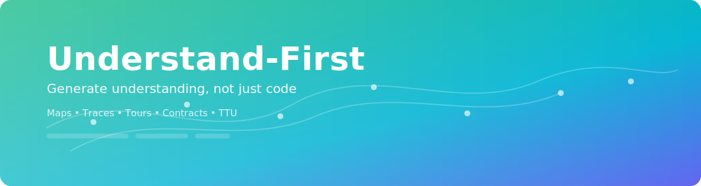

# Understand-First (TTU Kit)

[](https://github.com/your-org/understand-first/actions)

**Generate understanding, not just code.** This toolkit helps teams reduce **Time To Understanding (TTU)** and **Time To First Safe Change (TTFSC)** with maps, traces, tours, contracts, and PR guardrails.

<p align="center">
  
</p>

## What it does
- Builds maps: call graphs and dependency graphs (Python-first; TypeScript/Go adapters planned).
- Captures invariants: extracts pre/postcondition hints from code and tests and lists suspected side effects.
- Creates hot‑path fixtures: minimal, reproducible test scaffolds to read by running.
- Produces reading plans: auto-generates a module summary and questions to answer before editing.
- Enforces PR “Proof of Understanding”: CI can fail if map deltas, invariants, or module READMEs are missing.
- Measures context debt: simple metrics (missing READMEs, deep call chains, unmanaged side effects).

## Quick start
```bash
# requirements: Python 3.10+
cd cli
pip install -e .

# scan a codebase (try the toy project)
u scan ../examples/python_toy -o ../maps/repo.json

# create a task lens from seeds
u lens from-seeds --map ../maps/repo.json --seed compute -o ../maps/lens.json

# trace the hot path
u trace module ../examples/app/hot_path.py run_hot_path -o ../traces/tour.json

# merge runtime trace into the lens
u lens merge-trace ../maps/lens.json ../traces/tour.json -o ../maps/lens_merged.json

# produce a markdown tour
u tour ../maps/lens_merged.json -o ../tours/local.md

# generate and verify contracts (optional)
u contracts from-openapi ../examples/apis/petstore-mini.yaml -o ../contracts/contracts_from_openapi.yaml
u contracts from-proto ../examples/apis/orders.proto -o ../contracts/contracts_from_proto.yaml
u contracts compose -i ../contracts/contracts_from_openapi.yaml -i ../contracts/contracts_from_proto.yaml -o ../contracts/contracts.yaml
u contracts lean-stubs ../contracts/contracts.yaml -o ../contracts/lean/
u contracts verify-lean ../contracts/contracts.yaml -l ../contracts/lean
```

Open `maps/`, `contracts/`, and `examples/python_toy/` to see artifacts and experiment.

### Health check
```bash
u doctor
```
Verifies Python/Node, grpc_tools, VS Code, ports, and repo write permissions; exits non‑zero with fixes and a link to docs if problems are found.

### Guided demo
```bash
u demo
```
Generates contracts, starts services, traces the hot path, builds a tour and dashboard, and prints a shareable file:// URL.

## Concepts
- **TTU**: time from “new task” to “first accurate mental model.”
- **TTFSC**: time from “new task” to “first safe change merged.”
- **Context Debt**: the gap between the context a system requires and what it affords to readers.

## CLI overview
Key commands provided by the `u` CLI (see `u --help` for all):

- Scanning and mapping
  - `u scan <path> -o maps/repo.json`: Build a repository map (Python-first)
  - `u map maps/repo.json -o maps/`: Emit Graphviz DOT
  - `u report maps/repo.json -o maps/`: Emit a Markdown report

- Lenses and tours
  - `u lens from-issue --map maps/repo.json <issue.md> -o maps/lens.json`
  - `u lens from-seeds --map maps/repo.json --seed <file_or_symbol> -o maps/lens.json`
  - `u lens merge-trace maps/lens.json traces/tour.json -o maps/lens_merged.json`
  - `u lens preset --map maps/repo.json <label> -o maps/lens.json`
  - `u lens ingest-github <gh_actions_log.txt>` or `u lens ingest-jira <jira.json>`
  - `u lens explain <qualified.name> --lens maps/lens_merged.json --repo maps/repo.json`
  - `u tour maps/lens_merged.json -o tours/local.md`
  - `u tour_run --fixtures fixtures maps/lens_merged.json` (verify minimal fixture)

- Runtime tracing (Python demo)
  - `u trace module <pyfile> <function> -o traces/trace.json`
  - `u trace errors <pyfile> --json`

- Boundaries
  - `u boundaries scan <path> -o maps/boundaries.json`

- Contracts
  - `u contracts from-openapi examples/apis/petstore-mini.yaml -o contracts/contracts_from_openapi.yaml`
  - `u contracts from-proto examples/apis/orders.proto -o contracts/contracts_from_proto.yaml`
  - `u contracts compose -i contracts/contracts_from_openapi.yaml -i contracts/contracts_from_proto.yaml -o contracts/contracts.yaml`
  - `u contracts lean-stubs contracts/contracts.yaml -o contracts/lean/`
  - `u contracts verify-lean contracts/contracts.yaml -l contracts/lean`
  - `u contracts stub-tests contracts/contracts.yaml -o tests/test_contracts.py`

- Visualization
  - `u visual delta maps/old_lens.json maps/new_lens.json -o maps/delta.svg`

- Packs and publishing
  - `u pack create --lens maps/lens_merged.json --tour tours/local.md --contracts contracts/contracts_from_openapi.yaml -o packs/pack.zip`
  - `u pack --publish` (local pack in `dist/`)

- Glossary and dashboard
  - `u glossary -o docs/glossary.md`
  - `u dashboard --repo maps/repo.json --lens maps/lens_merged.json --bounds maps/boundaries.json -o docs/understanding-dashboard.md`

- Health, TTU, and init
  - `u doctor`
  - `u ttu <event>` or `u ttu report -o docs/ttu.md`
  - `u init` (creates `.understand-first.yml` and appends a brief tour section to `README.md`)
  - `u tour_gate --progress .uf-progress.json`
  - `u config_validate --path .understand-first.yml`

## Repository contents
- `cli/` – Typer-based CLI (`u`) for scanning, mapping, reporting, tracing, lenses, contracts, and visualization.
- `docs/` – onboarding, usage, privacy, and version notes.
- `ide/` – VS Code extension that overlays maps, shows tours, and explains error propagation.
- `examples/` – toy project and microservices for demos and CI.
- `maps/` – generated maps (JSON, DOT, markdown, SVG).
- `tests/` – unit tests for CLI components.

## VS Code extension
The VS Code extension contributes commands:
- `Understand-First: Show Tour` opens an interactive walkthrough with progress indicators and one-click commands.
- `Understand-First: Explain Error Propagation` shows seed nodes and guidance.
- `Understand-First: Generate Property Test` scaffolds language-aware property test templates.
- `Understand-First: Open Glossary` opens `docs/glossary.md` or a configured glossary path.
The editor displays lightweight decorations for call counts, runtime hotness, and contract presence when maps are available.

## Configuration
The file `.understand-first.yml` controls seeds, presets, hops, and metrics. Example:
```yaml
hops: 2
seeds: []
seeds_for:
  bug: [examples/app/hot_path.py]
metrics:
  enabled: false
```

## Roadmap
- Language adapters: TypeScript (tsserver/ts-morph), Go (go/ast), Java (Spoon).
- Map‑delta visualizer comment bot.
- Invariant DSL with optional Lean proof stubs.
- IDE integrations (VS Code) to overlay maps on code.

## Version 3 highlights
Objective: compress TTU and TTFSC by producing a scoped, runtime-grounded map for the current task, delivered in the IDE and PR.

New in v3:
- Better lensing: ingest CI/Jira logs to auto-extract stack traces and rank nodes by error proximity.
- Tour gate: run generated fixtures; fail PR if the tour cannot reproduce the path.
- Interface-based contracts: parse OpenAPI/Proto to generate contract entries and property test stubs; optional Lean proof stubs for critical flows.
- VS Code overlays: gutter badges for callers, runtime hotness, and contracts; quick-peek tours and packs.
- Map-delta visualizer: render a simple SVG lens delta and auto-attach to PR comments.

See `docs/v3-what-changed.md` and `docs/usage.md` for details.
