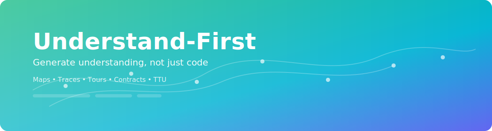

<p align="center">
  
</p>

> **Generate understanding, not just code.** Understand-First helps teams shrink **Time To Understanding (TTU)** and **Time To First Safe Change (TTFSC)** with repository maps, runtime traces, guided tours, interface contracts, and PR-friendly guardrails.

---

## Why this exists

Large codebases reward familiarity over clarity. Docs drift, static graphs show shape but not behavior, and reviewers rarely share the same mental model. Understand-First turns **reading paths** into **artifacts you can diff, gate in CI, and hand to the next person**.

### Compared to other approaches

| Capability | Understand-First | Static analysis | Doc generators | Review tools |
|------------|------------------|-----------------|------------------|--------------|
| Runtime tracing | Yes | No | No | No |
| Guided tours | Yes | No | No | No |
| Living maps tied to the repo | Yes | Partial | Manual | No |
| PR / CI hooks for understanding artifacts | Yes | Rare | No | Partial |
| TTU / context-debt style metrics | Yes | No | No | No |
| Multi-language | Python today; more planned | Varies | Varies | Varies |
| IDE overlays | VS Code extension | Varies | No | Varies |
| Contract extraction & checks | Yes | No | No | No |

### What you gain in practice

- **Faster onboarding** — Maps and tours compress “where do I start?” into something navigable.
- **Safer changes** — Traces show what actually ran, not only what imports suggest.
- **Reviewable understanding** — Tours and deltas can travel with the PR.
- **Visible context debt** — Simple metrics highlight depth, missing docs, and risky spots.

---

## What it does

- **Maps** — Call and dependency graphs (Python-first; other language adapters are planned).
- **Invariants & effects** — Surfaces pre/post hints, suspected side effects, and contract-linked structure.
- **Hot-path fixtures** — Small, runnable scaffolds tied to real execution.
- **Reading plans** — Module-oriented summaries and questions before you edit.
- **Proof-of-understanding hooks** — CI can require map deltas, invariants, or module READMEs where you configure it.
- **Metrics** — Lightweight signals for missing READMEs, deep chains, and unmanaged effects.

---

## Install

Pick one path; all assume a Unix-like shell unless noted.

### PyPI

```bash
pip install understand-first
u --help
```

### From source (recommended for development)

Uses the same dependency sets as CI (`uv.lock`).

```bash
git clone https://github.com/sentinelops-ci/understand-first.git
cd understand-first
make dev          # uv sync --all-extras, or pip install -e ".[dev,examples]"
```

Optional: run sample HTTP/gRPC servers and try the full demo.

```bash
make run
u demo
```

### Docker

```bash
docker run --rm ghcr.io/sentinelops-ci/understand-first:latest --help
```

### Without installing

Open the [interactive web demo](web_demo/index.html) in a browser to experiment with analysis and exports locally.

---

## First steps

```bash
u doctor              # environment and tooling check
u demo                # end-to-end guided run (after install from source + make run, if you use the demo stack)

u scan . -o maps/repo.json
u lens from-seeds --map maps/repo.json --seed main -o maps/lens.json
u tour maps/lens.json -o tours/understanding.md
```

Initialize a project-specific config when you are ready:

```bash
u init --wizard
```

---

## End-to-end workflow

```bash
# 1. Map the codebase
u scan examples/python_toy -o maps/repo.json

# 2. Focus a lens from seeds
u lens from-seeds --map maps/repo.json --seed compute -o maps/lens.json

# 3. Trace runtime (optional)
u trace module examples/app/hot_path.py run_hot_path -o traces/tour.json

# 4. Merge trace into the lens
u lens merge-trace maps/lens.json traces/tour.json -o maps/lens_merged.json

# 5. Generate a tour
u tour maps/lens_merged.json -o tours/local.md

# 6. Contracts (optional)
u contracts from-openapi examples/apis/petstore-mini.yaml -o contracts/contracts_from_openapi.yaml
u contracts compose -i contracts/contracts_from_openapi.yaml -o contracts/contracts.yaml
u contracts lean-stubs contracts/contracts.yaml -o contracts/lean/
u contracts verify-lean contracts/contracts.yaml -l contracts/lean
```

Explore `maps/`, `contracts/`, and `examples/` for generated artifacts.

---

## Examples in this repo

| Example | Run | Focus |
|--------|-----|--------|
| **FastAPI e-commerce** | `python examples/fastapi_ecommerce/main.py` | Async API, DI, Pydantic, JWT |
| **React dashboard** | `cd examples/react_dashboard && npm ci && npm run dev` | Vite, hooks, client structure |
| **Microservices** | `python examples/microservices/order_service.py` (and related) | Services, Redis, async boundaries |
| **Flask blog** | `python examples/flask_blog/app.py` | Blueprints, auth, forms |
| **Django e-commerce** | `cd examples/django_ecommerce && python manage.py runserver` | ORM, admin, views |

**Analyze an example with the CLI**

```bash
u scan examples/django_ecommerce -o maps/django_repo.json
u lens from-seeds --map maps/django_repo.json --seed "models.py" -o maps/django_lens.json
u tour maps/django_lens.json -o tours/django_tour.md
```

---

## Web demo

The [browser demo](web_demo/index.html) runs entirely on your machine: paste Python, inspect structure, explore tours and exports (JSON, Markdown, tour formats), and try complexity and call-graph views without installing the CLI.

---

## Templates

Technology-oriented `.understand-first.yml` starters live under `templates/`. Generate one interactively:

```bash
u init --wizard
```

Supported flavors include Django, FastAPI, React, Flask, microservices, Node, Go, Java, and general Python. Each template carries seed presets, include/exclude patterns, and sensible defaults for analysis and CI-oriented workflows.

---

## Sample outputs

### Repository map (excerpt)

```json
{
  "language": "python",
  "functions": {
    "examples/python_toy/pkg/service:compute": {
      "file": "examples/python_toy/pkg/service.py",
      "calls": ["add", "maybe_log"],
      "callers": [],
      "complexity": 3,
      "side_effects": ["logging"]
    }
  }
}
```

### Tour (excerpt)

```markdown
# Understanding Tour: Hot Path Analysis

## Step 1: HTTP Service Check
**File**: `examples/app/hot_utils.py:wait_http()`
**Purpose**: Ensures the HTTP service is available before making requests.
```

### Contract snippet

```yaml
ROUTE::pets:
  GET /pets:
    request_schema: {}
    response_schema:
      type: array
      items: {type: object, properties: {id: string, name: string}}
    postconditions: ["response.status_code == 200"]
    side_effects: ["database_read"]
```

### Health check and demo

```bash
u doctor   # Python, Node, grpc_tools, VS Code, ports, repo permissions
u demo     # contracts, services, trace, tour, dashboard; prints a local file URL
```

---

## Concepts

| Term | Meaning |
|------|---------|
| **TTU** | Time from “new task” to a first accurate mental model. |
| **TTFSC** | Time from “new task” to a first safe change merged. |
| **Context debt** | Mismatch between the context the system demands and what the codebase affords readers. |

---

## Command reference

<details>
<summary><strong>Full <code>u</code> command list</strong> (click to expand)</summary>

- **Scanning & mapping** — `u scan`, `u map`, `u report`
- **Lenses & tours** — `u lens` (from-issue, from-seeds, merge-trace, preset, ingest-*, explain), `u tour`, `u tour_run`
- **Tracing** — `u trace module`, `u trace errors`
- **Boundaries** — `u boundaries scan`
- **Contracts** — `u contracts from-openapi`, `from-proto`, `compose`, `lean-stubs`, `verify-lean`, `stub-tests`
- **Visualization** — `u visual delta`
- **Packs** — `u pack create`, `u pack --publish`
- **Glossary & dashboard** — `u glossary`, `u dashboard`
- **Health & config** — `u doctor`, `u ttu`, `u init`, `u tour_gate`, `u config_validate`

See `u --help` for flags and subcommands.

</details>

---

## Repository layout

| Path | Role |
|------|------|
| `cli/` | Typer-based `u` CLI: scan, map, trace, lenses, contracts, visualization |
| `docs/` | Onboarding, usage, API notes, privacy |
| `ide/` | VS Code extension (maps, tours, error propagation) |
| `examples/` | Django, FastAPI, Flask, React (Vite), microservices, toys |
| `templates/` | Project-type starters for `u init` |
| `web_demo/` | Static interactive demo |
| `maps/` | Generated maps (JSON, DOT, Markdown, SVG) |
| `tests/` | CLI and component tests |

---

## VS Code extension

With `maps/*` and a lens present, the extension adds decorations for call counts, runtime hotness, and contract hints. Commands include **Show Tour**, **Explain Error Propagation**, **Generate Property Test**, and **Open Glossary**. See `ide/vscode/understand-first/README.md` for packaging and local development.

---

## Configuration

**Wizard**

```bash
u init --wizard
```

**Copy a template**

```bash
cp templates/django/.understand-first.yml .understand-first.yml
# or fastapi, microservices, react, …
```

**Minimal manual file**

```yaml
hops: 2
seeds: []
seeds_for:
  bug: [examples/app/hot_path.py]
  feature: [*/models.py, */views.py]
contracts_paths:
  - contracts/api_contracts.yaml
glossary_path: docs/glossary.md
metrics:
  enabled: false
```

More detail: `docs/usage.md` and `docs/onboarding.md`.

**CI example**

```yaml
- name: Understand-First
  run: |
    u scan . -o maps/repo.json
    u lens preset feature --map maps/repo.json -o maps/lens.json
    u tour maps/lens.json -o tours/ci-tour.md
```

---

## Roadmap

- Language adapters: TypeScript, Go, Java (see issues and `docs/` for direction).
- Map-delta visualizations and richer PR comment flows.
- Invariant DSL with optional Lean stubs.
- Deeper IDE integration beyond the current VS Code extension.

---

## Resources

| Resource | Link |
|----------|------|
| Repository | [github.com/sentinelops-ci/understand-first](https://github.com/sentinelops-ci/understand-first) |
| Examples | [examples/](https://github.com/sentinelops-ci/understand-first/tree/main/examples) |
| Contributing | [docs/CONTRIBUTING.md](docs/CONTRIBUTING.md) |
| Web demo (hosted) | [GitHub Pages demo](https://sentinelops-ci.github.io/understand-first/demo) |

This project uses Understand-First for its own analysis workflows; the commands above apply whether you are evaluating the toolkit or contributing upstream.
